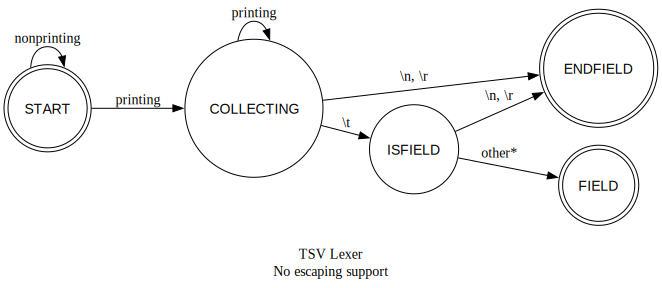

# ctabs
TSV Parser in C

- Inspired by TSV language spec (IANA media type standard):

[https://www.iana.org/assignments/media-types/text/tab-separated-values](https://www.iana.org/assignments/media-types/text/tab-separated-values)

## Building

- Build with `make`
